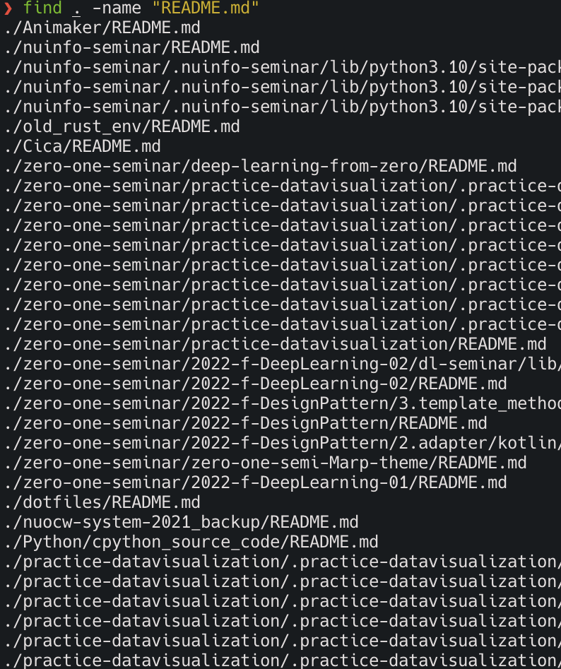
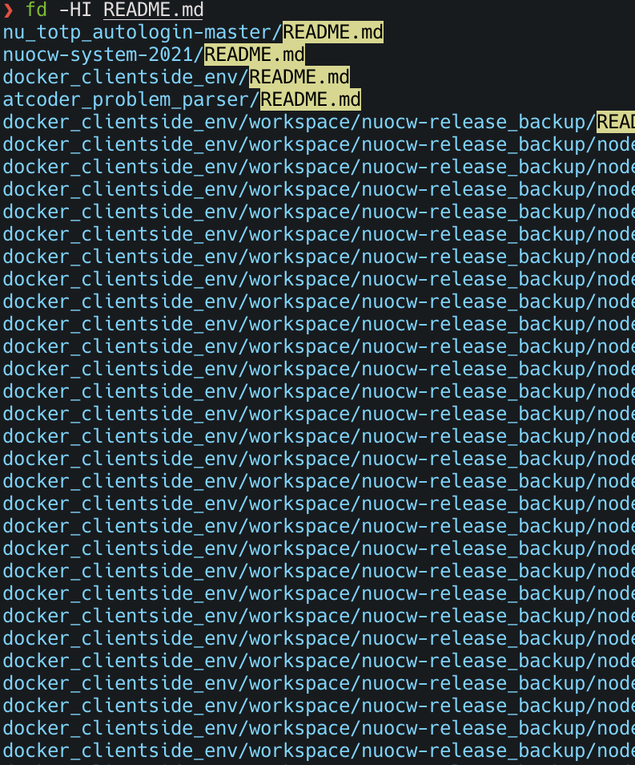
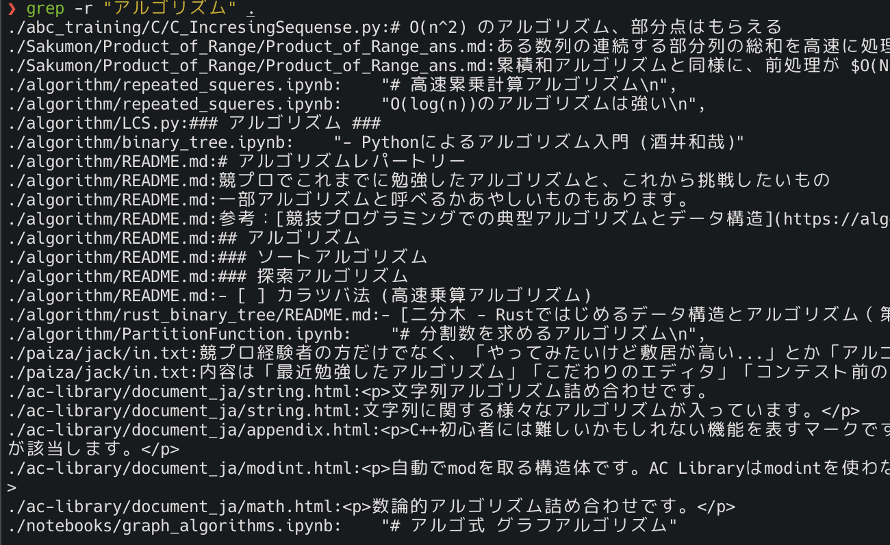
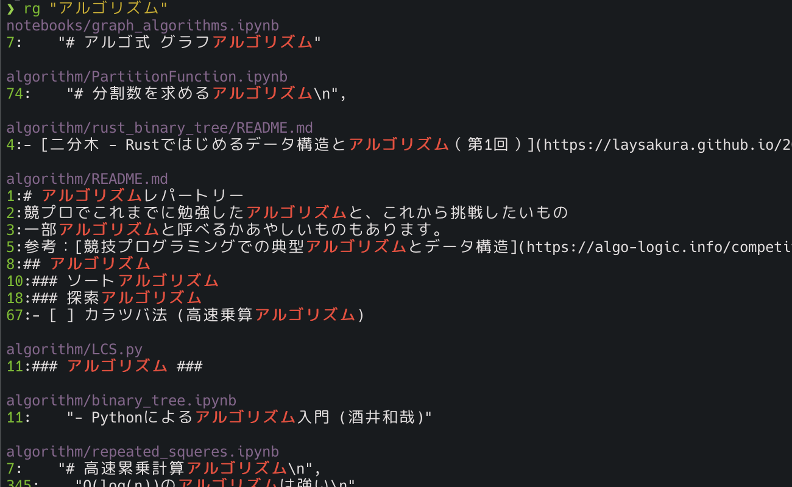
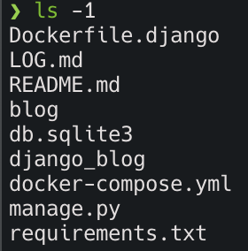
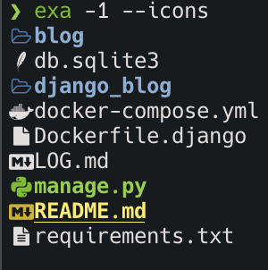
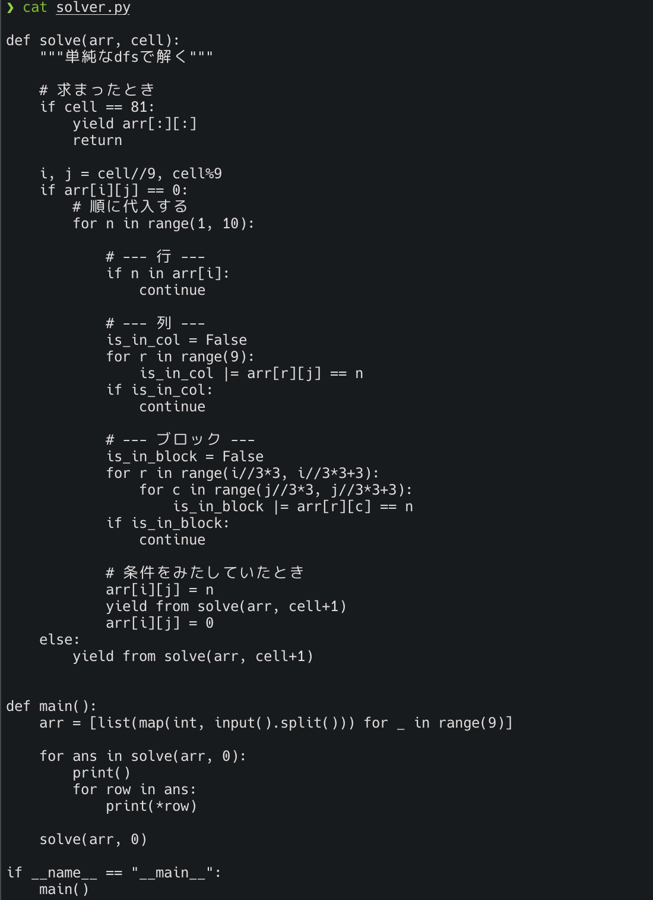
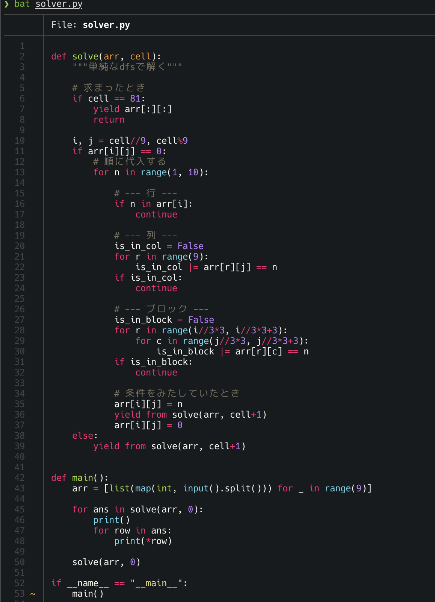

## うわっ…私のコマンド、遅すぎ…？
#### Rust再実装コマンドでターミナルをもっと便利に

  
ぱうえる（甲本健太）

Github：[@kentakom1213](https://github.com/kentakom1213)

<!-- 
class: title, invert
-->

---
# Rustとは

- C/C++並に速く、安全性が高い言語
- 主な用途
  - コマンドラインツール
  - Webアプリケーション
  - OSの開発

公式：www.rust-lang.org/ja

---
# 今回紹介するコマンドたち

| 前 | 後 | コマンドの意味 |
| :-: | :-: | :- |
| find | fd | ファイルを探す |
| grep | ripgrep | ファイルの中身を検索する |
| ls | exa | ディレクトリの中を見る |
| cat | bat | ファイルの中を見る |

---
# `find` → `fd`
ファイルを探す

- **高速！**
  `README.md`（7569個）を計測
    - `find`：8.0 sec
    - `fd`：0.75 sec

- デフォルトで色付けあり
- デフォルトで`.gitignore`を無視

公式：github.com/sharkdp/fd

---

---
# `grep` → `ripgrep`
ファイルの中身を検索する

- **100倍程度高速！**
  1434ファイルの中から`"アルゴリズム"`という文字列を検索
  - `grep`：0.062 sec
  - `ripgrep`：3.8 sec

- みやすい！

公式：github.com/BurntSushi/ripgrep

---
## `grep`コマンド

---
## `ripgrep`コマンド

---
# `ls` → `exa`
ディレクトリの中を表示する

- デフォルトで色付けあり
- 絵文字を設定できる:smile:
- tree形式でも表示できる

公式：github.com/ogham/exa

---

---
# `cat` → `bat`
ファイルの中身を表示する

- まるでエディタのようにファイルを見れるコマンド
- デフォルトでシンタックスハイライトあり

公式：github.com/sharkdp/bat

---

---
# その他おすすめツール

- [xcp](https://github.com/tarka/xcp)：`cp`コマンドの再実装
- [delta](https://github.com/dandavison/delta)：`diff`コマンドの再実装
- [Starship](https://starship.rs/ja-jp/)：コマンドラインを可愛くできるツール

### 参考
- [awsome-alternatievs-in-rust](https://github.com/TaKO8Ki/awesome-alternatives-in-rust)

