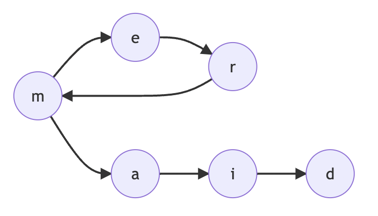
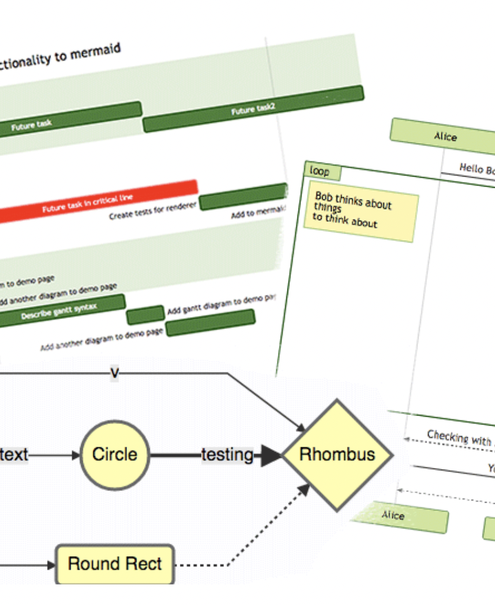
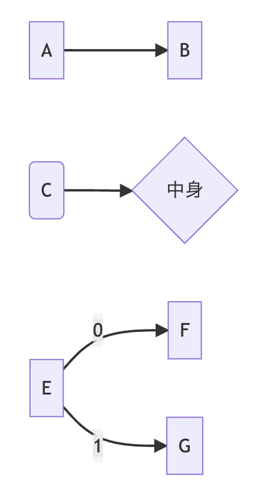
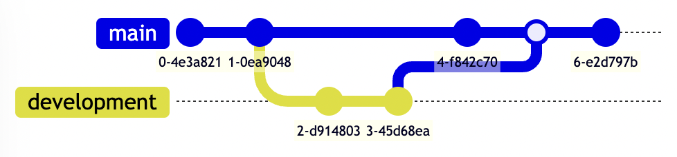
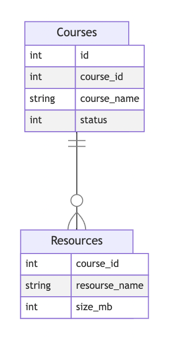

## フローチャートを作ろう！
# Mermaid入門

---
# はじめに
## こんなとき、ありませんか？
- 描画ソフトが多くて、使いこなせない...
- せっかく図を書いたけど、共有が面倒...
- 図を共同で編集したいけど、いちいち送るのが大変...


---
# Mermaidってなに？
- Markdownの中に簡単なコードだけで図を埋め込めるツールです
- Github, esa, Notion, Qiita, Zenn などで使える！
- [mermaid.live](https://mermaid.live) $\leftarrow$ お試し用



---
# メリット・デメリット

## メリット
- 全て文字列で表現される！
    - あらゆるエディタで編集できる
    - データの共有が楽
    - gitで管理できる
- 手書きよりも綺麗

## デメリット
- 細かい調整が難しい
  (ノードの配置など)

---
# どんな図が作れるの？


- フローチャート
- シーケンス図
- ガントチャート
- クラス図 / ER図
- GitGraph
- パイチャート

などなど...

出典: https://mermaid-js.github.io

---
# どんなコードになってるの？
- フローチャート
- GitGraph
- ER図

---
## フローチャート


- 頂点、辺を記述する
- 頂点の形、辺の特徴(実線、点線など)を調整できる

```
graph LR
    A --> B
    C(C) --> D{中身}
    E --0--> F
    E --1--> G
```

---
## GitGraph
```
gitGraph
    commit
    commit
    branch development
    commit
    commit
    checkout main
    commit
    merge development
    commit
```


---
## ER図


```
erDiagram
    Courses ||--o{ Resources : ""

    Courses {
        int id
        int course_id
        string course_name
        int status
    }

    Resources {
        int course_id
        string resourse_name
        int size_mb
    }
```

---
# どんどん使っていきましょう！

## 参考
- [Mermaid Documentation](https://mermaid-js.github.io/mermaid/#/)
- [MermaidでER図のスケッチをしたら簡単すぎて衝撃だった - Zenn](https://zenn.dev/kyohei_shibuya/articles/0cafee2a1c1651)
- [[mermaid] git graphについて - Qiita](https://qiita.com/z6wdc/items/e05ef0ef0a8bef139e52)