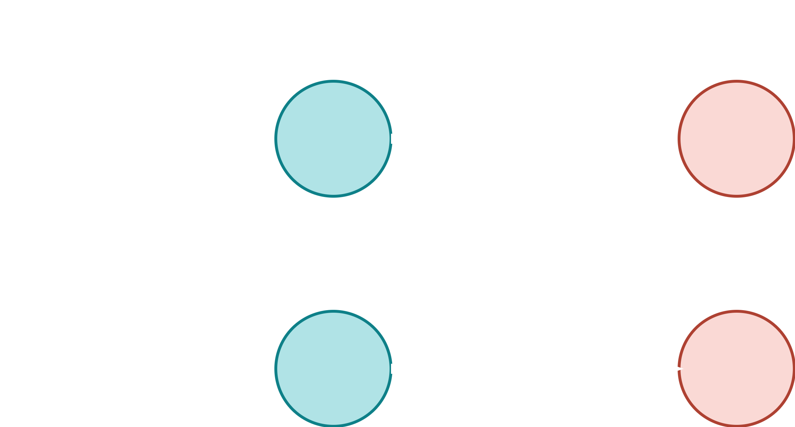
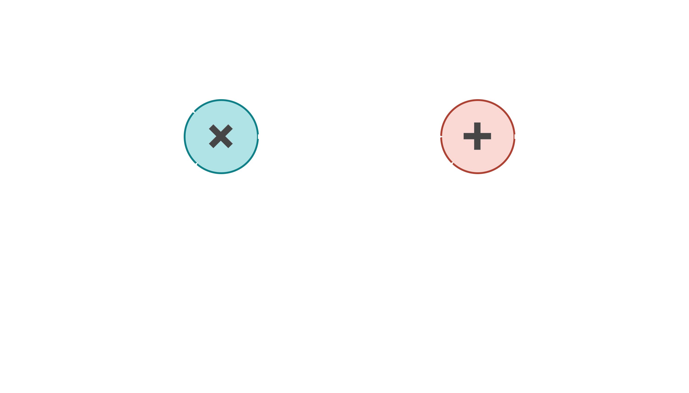
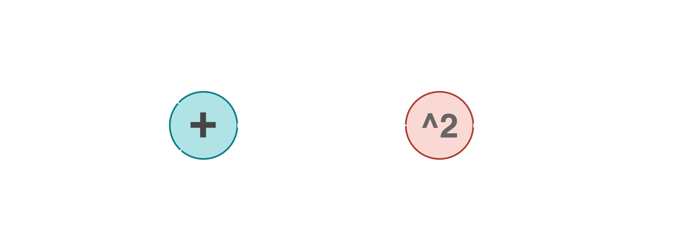
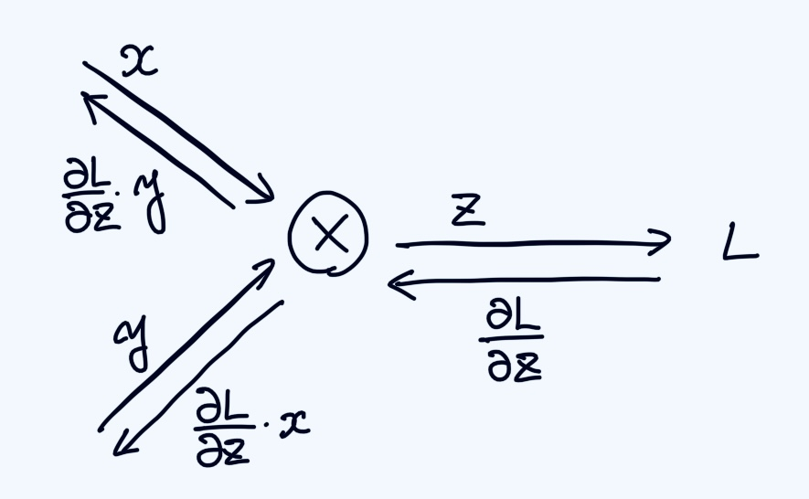

<!--
headingDivider: 2
_class: title
_paginate: false
-->

# 誤差逆伝播法について

<a style="color:#eeeeee; text-decoration: none;" href="https://github.com/kentakom1213">ぱうえる（けんた）:link:</a>

## 誤差逆伝播法とは？

- 前回までは、学習のために勾配を求める過程で**数値微分**という手法を利用しました
- **誤差逆伝播法**では、この過程をさらに効率的に行うことができます

| | 数値微分 | 誤差逆伝播法 |
| - | - | - |
| 実装 | 簡単 | 難しい |
| 速度 | 遅い | 速い |

## 計算グラフとは？

- 計算の過程を**グラフ**の形で表したもの
  （グラフ：[グラフ理論](https://ja.wikipedia.org/wiki/%E3%82%B0%E3%83%A9%E3%83%95%E7%90%86%E8%AB%96)という数学の分野の用語）

## 計算グラフの例

計算式 $20 \times 5  + 30 = 130$ を計算グラフとして表してみる。

## 誤差逆伝播法のどこがすごいのか

> 計算グラフの特徴は、「局所的な計算」を伝播することによって最終的な結果を得ることができる点にあります。
> (ゼロから作るDeepLearning, p126)

- 全体の微分を一気に求める
  → 時間がかかる
- 計算グラフで少しずつ微分していく
  → トータルで見ると高速！ （分割統治法）

## 連鎖律

→「合成関数の微分」のこと

$$
\begin{align}
    \lbrace f(g(x)) \rbrace' &= f'(g(x)) \cdot g'(x)\\[5pt]
    \lbrace f(g(h(x))) \rbrace' &= f'(g(h(x))) \cdot g'(h(x)) \cdot h'(x)\\[5pt]
    \vdots
\end{align}
$$

微分を、掛け算の集まりとして計算できる！

## 逆伝播

## 乗算ノードの逆伝播

