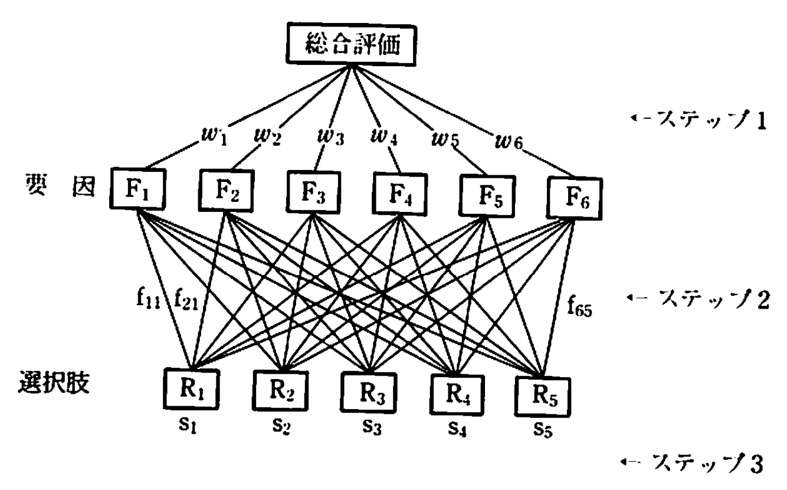

<!-- _class: title -->
# 階層分析法

数理情報系3年
甲本健太

# 問題設定

T君は鎌ヶ谷市に住んでおり，大岡山にあるT工大に通っている．
T君は通学用の定期券を買うにあたって，
> 天候，季節，体調，時間的余裕，時間帯，曜日，万歩計指数

の7つの変数をもとに，以下の5つの中から最適なルートを決定することにした．

**比較するルート**

$R_1: 鎌ヶ谷→船橋→品川→大井町→大岡山$
$R_2: 鎌ヶ谷→船橋→中延→大岡山$
$R_3: 鎌ヶ谷→船橋→芽番町→自由が丘→大岡山$
$R_4: 鎌ヶ谷→船橋→日本橋→中延→大岡山$
$R_5: 鎌ヶ谷大仏→津田沼→品川→大井町→大岡山$

# 評価要因

### ルート決定に用いる6つの要因

$F_1: 自宅から駅までの所要時間\cdots 短いほど良い$
$F_2: 電車に乗っている実時間\cdots 短いほど良い$
$F_3: 所要運賃\cdots 安いほど良い$
$F_4: 自宅から大学までの総所要時間\cdots 短いほど良い$
$F_5: 乗り換えの回数と所要時間\cdots 少ないほど良い$
$F_6: 電車の混雑度\cdots 空いている方が良い，座れればなお良い$

この他にも，「$F_7: 定期券の利用度$」 などが加わる可能性もある．

# 基礎データ

 

$$
\begin{array}{c|l|c|c|c|c|c}
  \hline
  & \footnotesize ルート & R_1 & R_2 & R_3 & R_4 & R_5\\
  \hline
  F_1 & \footnotesize 最寄り駅までの所要時間(分) & 10 & 10 & 10 & 10 & 7\\
  \hline
  F_2 & \footnotesize 実乗車時間(分) & 62 & 72 & 72 & 64 & 74\\
  \hline
  F_3 & \footnotesize 片道切符(円) & 760 & 730 & 710 & 710 & 870\\
  & \footnotesize 1ヶ月定期(円) & 11,210 & 11,930 & 9,750 & 12,460 & 12,720\\
  \hline
  F_4 & \footnotesize 乗り換え回数 & 3 & 2 & 3 & 3 & 3\\
  & \footnotesize 乗り換え時間 & 7 & 8 & 6 & 7 & 10\\
  \hline
  F_5 & \footnotesize 総合所要時間 & 85.5 & 97 & 99 & 89 & 97.5\\
  & \footnotesize 乗り換え待ち時間 & 6.5 & 7 & 11 & 8 & 6.5\\
  \hline
\end{array}
$$

$$
\begin{array}{c|c}
  \footnotesize ルート & F_6 : \footnotesize 混雑度\\
  \hline
  R_1 & \footnotesize 電車を1\sim 2本待たないと乗れない\\
  R_2 & \footnotesize 普通\\
  R_3 & \footnotesize 東西線は混雑する\\
  R_4 & \footnotesize 東西線は混雑する\\
  R_5 & \footnotesize 津田沼で始発電車に座れる
\end{array}
$$

# 各ルートの比較

各ルートを評価項目ごとに比較すると，以下のようになる．
 

- $R_1$：時間は早いが，混雑度は最悪である
- $R_2$：乗り換え回数と混雑度では優れているが，時間がかかる
- $R_3$：安いが，混んでいて時間がかかる
- $R_4$：可もあり不可もあり
- $R_5$：座れるが，時間と値段が悪い
 

→ **どれも一長一短であるため，判断が難しい**

# 階層分析法とは

今回用いる手法「階層分析法」

→ "複数の選択肢"の中から最良のものを選び出すための方法

### 多属性効用分析との違い

- **多属性効用分析**
  効用理論に裏付けされた手法．使いこなすのが難しい
- **階層分析法**
  厳密さよりも使いやすさを重視した手法

# 階層分析法の流れ

1. 評価要因の洗い出し
2. 評価要因の木を作成

# 評価要因の木

次のステップとして，「評価要因の木」を構築する．

総合評価に，$F_1\sim F_6$ が関わっている場合．

%%{init:{'theme':'default','flowchart':{'curve':'linear'}}}%%
graph TD
  root[総合評価]
  root --- f1[F1]
  root --- f2[F2]
  root --- f3[F3]
  root --- f4[F4]
  root --- f5[F5]
  root --- f6[F6]

# 評価要因の木
## 2階層の木

$F_1,F_2,F_5$ をひとまとまりにして $F_0: 所要時間$ として評価する場合

%%{init:{'theme':'default','flowchart':{'curve':'linear'}}}%%
graph TD
  root[総合評価]
  subgraph 第1階層
    f0[F0]
    f3[F3]
    f4[F4]
    f6[F6]
  end
  subgraph 第2階層
    f1[F1]
    f2[F2]
    f5[F5]
  end
  root --- f0
  root --- f3
  root --- f4
  root --- f6
  f0 --- f1
  f0 --- f2
  f0 --- f5

# 「評価要因の木」の条件

複雑な意思決定問題を考える際には，どのように**評価要因の木**を考えるかが重要になる．

### 「評価要因の木」を設計するためのガイドライン

1. 同一階層に位置する要因相互の重要度には決定的な差がないこと
2. 木の先端に位置する要因に関して，選択肢の相対的優劣を判断することがそれほど難しくないこと
3. 階層数は多くても**3つ**程度に留めること   *なぜ？*

# 階層分析法の概略

 

**1. 重要度決定プロセス**

選択肢 $R_1,\cdots, R_5$ の総合評価を行うにあたって，評価要因 $F_1,\cdots,F_6$ のそれぞれが相対的にどれだけ重要であるかを表す非負の**重要度係数** $w_1,\cdots,w_6 ~(\sum_i w_i = 1)$ を求める．

**2. 選択肢の要因別評価**

評価要因 $F_i ~(i=1,\ldots,6)$ に関して，各選択肢 $R_1,\ldots,R_5$ が相対的にどれだけ優れているかを表す相対評点 $f_{i1},\cdots,f_{i5} ~(\sum_l f_{il} = 1)$ を求める．

**3. 総合得点の計算**

$R_i ~(i=1,\ldots,5)$ の総合得点 $s_j$ を評点の加重和として次の式で決定する．

$$
s_j = w_1f_{1j} + w_2f_{2j} + w_3f_{3j} + w_4f_{4j} + w_5f_{5j} = w_6f_{6j} \hspace{12mm}\tag{3.1}
$$

そして $s_j$ が最大である選択肢 $R_j$ を最良の選択肢とする．

# プロセスの図解

# 重要度の決め方

