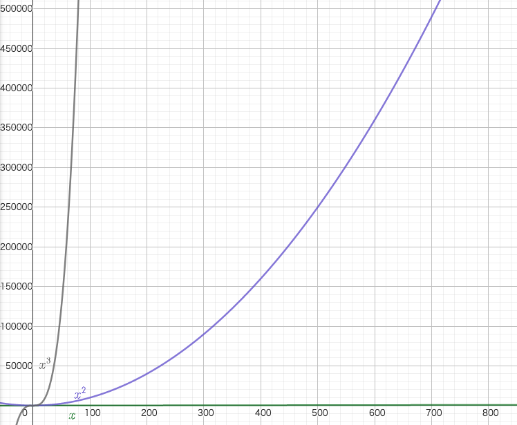
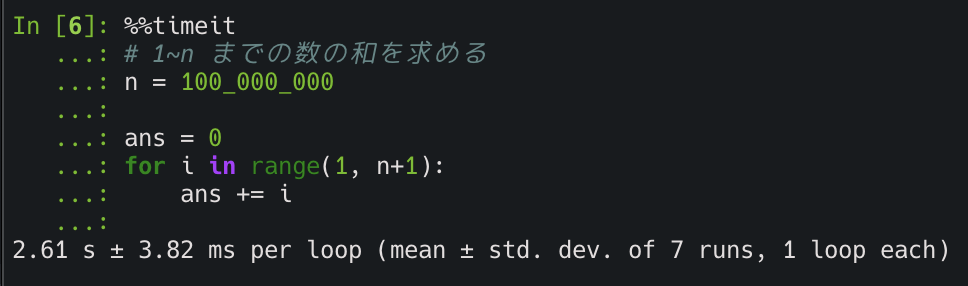

<style>
  .title-font {
    color: #455a64;
  }
  .red {
    color: #ff0000;
  }
</style>

<!--
headingDivider: 2
_class: title
_paginate: false
-->
# 計算量を学ぼう！

<a style="color:white; text-decoration: none;" href="https://github.com/kentakom1213">ぱうえる（けんた）:link:</a>

## 速いコードが書きたい！

でも**速いコード**ってどうやって評価する？？

- 「 $1,000,000$ 個のデータに対して $5$ 秒で終了しました！」
  - データの個数が変わったらどうなる？？
  - そもそもPythonで実行するかC言語で実行するかでも変わりそう

<hr>

**「データの大きさ」や「実行する環境」に依存しない評価方法が必要**
<span style="font-size:50px" class="red">→計算量の出番</span>

## オーダー記法 (1/2)

<div style="float:left;">

  
</div>

- $n,n^2,n^3$ では $n$ が大きくなったとき
  値が大きく変化する
- 定数倍を考えないで、$n$ の項だけに
  注目すればいいのでは？？

→ $O$ (ランダウの記号)を用いる

## オーダー記法 (2/2)

- 計算量は基本的にオーダー記法で書く
  1. 一番大きい項のみ残して表記する
    $c < \log n < n^c < c^n < n!$ （$c$ は定数）
  2. 定数倍は無視する

オーダー記法の例）

$$
\begin{align*}
  5n^3+4n^2+100n &\longrightarrow O(n^3)\\
  2^n+n^{100}+10^9n &\longrightarrow O(2^n)\\
\end{align*}
$$


## コードの計算量の調べ方

- $n$ 回のループをする → $O(n)$
- $n$ 回のループの中で $n$ 回のループをする（二重ループ）
  → $O(n^2)$
- [bit全探索](https://drken1215.hatenablog.com/entry/2019/12/14/171657)（$n$ 個の要素について**ある**/**ない**の $2$ 通りを考える）
  → $O(2^n)$
- $n$ 個の順列を全て調べる → $O(n!)$


## ここまでの復習
このコードの計算量は？？

```python
## 1~n までの数の和を求める
n = int(input())

ans = 0
for i in range(1, n+1):
    ans += i

print(ans)
```

## ここまでの復習（答え）
このコードの計算量は？？

```python
## 1~n までの数の和を求める
n = int(input())

ans = 0
for i in range(1, n+1):
    ans += i

print(ans)
```

→ $O(n)$ （$n$ までのループを1回している）


## 計算量の使い方
- 一般的なコンピュータが1秒間に計算できる回数は**約 $\mathbf{10^8}$ 回**
- 競プロの実行時間制限は大体 $1\!\sim\! 3$ 秒
- 各計算量ごとの、制限時間に間に合う $N$

$$
\scriptsize
\begin{array}{ll}
  O(N) &: N \leqslant 10^7\\
  O(N\log N) &: N \leqslant 10^6\\
  O(N^2) &: N \leqslant 10^4\\
  O(N^3) &: N \leqslant 300\\
\end{array}
$$

↓ $n$ の大きさと実際の値は次ページの表のようになります


---
$$
\scriptsize
\begin{array}{lllllll}
  \log n & n & n\log n & n^2 & n^3 & 2^n & n!\\
  \hline
  2 & \mathbf{5} & 12 & 25 & 130 & 30 & 120\\
  3 & \mathbf{10} & 33 & 100 & 1000 & 1024 & 3628800\\
  4 & \mathbf{15} & 59 & 225 & 3375 & 32768 & -\\
  4 & \mathbf{20} & 86 & 400 & 8000 & 1048576 & -\\
  5 & \mathbf{25} & 116 & 625 & 15625 & - & -\\
  5 & \mathbf{30} & 147 & 900 & 27000 & - & -\\
  7 & \mathbf{100} & 664 & 10000 & 1000000 & - & -\\
  8 & \mathbf{300} & 2468 & 90000 & 27000000 & - & -\\
  10 & \mathbf{1000} & 9966 & 1000000 & - & - & -\\
  13 & \mathbf{10000} & 132877 & 100000000 & - & - & -\\
  16 & \mathbf{100000} & 1660964 & - & - & - & -\\
  20 & \mathbf{1000000} & 19931568 & - & - & - & -\\
  \hline
\end{array}
$$

<div style="font-size:20px; text-align:center;">

参考：https://qiita.com/drken/items/872ebc3a2b5caaa4a0d0#1-3-%E8%A8%88%E7%AE%97%E9%87%8F%E3%81%AE%E4%BD%BF%E3%81%84%E6%96%B9
</div>

<!--
_header: ""
_footer: ""
-->


## 計算量を落とすテクニック

今回は代表的なものを2つ紹介します。

- <a href="#formula">**式変形**</a>
  比較的単純だけど、強力な手法
- <a href="#acc">**累積和**</a>
  数列の区間の和を高速に求めるアルゴリズム


## <a name="formula" class="title-font">式変形</a>

先ほどの $1\!\sim\! n$ までの数の和を求めるプログラムを高速化してみよう

```python
## 1~n までの数の和を求める
n = int(input())

ans = 0
for i in range(1, n+1):
    ans += i

print(ans)
```


## 式変形

このコードは、$1\!\sim\!n$ の和を求めるために $O(n)$ の計算をしています
（$n = 100,000,000$ で2.6秒くらい必要）<span class="red">→間に合わない！</span>




## 式変形

等差数列の和の公式を使えば…

$$
\sum_{i=1}^{n} = \frac{1}{2} n(n+1)
$$

```python
## 1~n までの数の和を求める
n = int(input())
ans = n * (n + 1) // 2

print(ans)
```


## 式変形


なんと、53.7**ナノ**秒で終了！！

→ 約**5億倍**の高速化（ちょっと極端な例ではあるけど）
→ もちろん余裕で間に合う


## 演習問題（式変形）

- Q4. 積の総和 (1)（アルゴ式）
  https://algo-method.com/tasks/1019
- ARC107 A - Simple Math（AtCoder）
  https://atcoder.jp/contests/arc107/tasks/arc107_a


## <a name="acc" class="title-font">累積和</a>

あるたい焼き屋さんでは 毎日、売れた個数を記録しています。
営業開始から $7$ 日目までの売り上げは以下の通りでした。

$$
\scriptsize
\begin{array}{|c|c|c|c|c|c|}
  \hline
  1日\!目 & \colorbox{yellowgreen}{2日\!目} & \colorbox{yellowgreen}{3日\!目} & \colorbox{yellowgreen}{4日\!目} & \colorbox{yellowgreen}{5日\!目} & 6日\!目 & 7日\!目\\
  \hline
  20 & 50 & 30 & 10 & 30 & 0 & 40\\
  \hline
\end{array}
$$

$2$ 日目から $5$ 日目までの売り上げの合計はいくらでしょうか？

→ $50+30+10+30=120$（個）

## 累積和

<hr>

あるたい焼き屋さんでは、$N$ 日間毎日売り上げを記録しています。
営業開始から $i$ 日目の売り上げは $A_i$ 円でした。
このとき、以下の $Q$ 個のクエリ（質問）に答えて下さい。
$a$ 日目から $b$ 日目までの売り上げの合計はいくらでしょうか？
<hr>

- $1\leqslant a\leqslant b\leqslant N\leqslant 10^5$
- $0\leqslant A_i\leqslant 10^9$
- $1\leqslant Q\leqslant 10^5$


## 累積和

各項を毎回足していくと、毎回のクエリで $\small A_a + A_{a+1} + \cdots + A_b$ という足し算をすることになる。→最大で $O(N)$ 回
よって、 $Q$ 個のクエリを処理すると、計算量は $O(NQ)$ ！！
<span class="red">→間に合わない！</span>

$$
\begin{array}{|c|c|c|c|c|c|}
  \hline
  A_1 & \colorbox{yellowgreen}{$A_2$} & \colorbox{yellowgreen}{$A_3$} & \colorbox{yellowgreen}{$A_4$} & \colorbox{yellowgreen}{$A_5$} & A_6 & A_7\\
  \hline
  20 & 50 & 30 & 10 & 30 & 0 & 40\\
  \hline
\end{array}
$$


## 累積和

そこで、$\small S_k = \sum_{i=0}^{k} A_i$ を満たす $S_i$ を考える。（**累積和**）
このとき、$S_b - S_{a-1}$ が求める区間の和になる。

<hr>
証明）

$$
\small
\begin{align}
      & S_b     &= &A_1 + A_2 + \cdots + A_{a-1} + \colorbox{yellowgreen}{$A_a + \cdots + A_b$}\\
  -)~ & S_{a-1} &= &A_1 + A_2 + \cdots + A_{a-1}\\
  \hline
      & S_b - S_{a-1} &= &\colorbox{yellowgreen}{$A_a + \cdots + A_b$}
\end{align}
$$


## 累積和

つまり？？

$$
\colorbox{yellowgreen}{50} + \colorbox{yellowgreen}{30} + \colorbox{yellowgreen}{10} + \colorbox{yellowgreen}{30} 
= \colorbox{violet}{140} - \colorbox{skyblue}{20}
= 120
$$

$$
\small
\begin{array}{|c|c|c|c|c|c|c|}
  \hline
  i & 0 & 1 & 2 & 3 & 4 & 5 & 6 & 7\\
  \hline
  A_i & - & 20 & \colorbox{yellowgreen}{50} & \colorbox{yellowgreen}{30} & \colorbox{yellowgreen}{10} & \colorbox{yellowgreen}{30} & 0 & 40\\
  \hline
  S_i & 0 & \colorbox{skyblue}{20} & 70 & 100 & 110 & \colorbox{violet}{140} & 140 & 180\\
  \hline
\end{array}
$$


## 累積和

累積和配列の計算方法

$$
\begin{align}
  S_0 &= 0\\
  S_i &= A_i + S_{i-1} \quad (1 \leqslant i \leqslant N)
\end{align}
$$


<!-- 
$$
\small
\begin{array}{|c|c|c|c|c|c|c|}
  \hline
  i & 0 & 1 & 2 & 3 & 4 & 5 & 6 & 7\\
  \hline
  A_i & - & 20 & 50 & 30 & 10 & 30 & 0 & 40\\
  \hline
  S_i & 0 & 20 & 70 & 100 & 110 & 140 & 140 & 180\\
  \hline
\end{array}
$$
-->


## 累積和

累積和の計算量は？

- $S$ を求めるのに $O(N)$ : $S_0$ から $S_N$ まで $N$ 回計算する
- クエリの計算に $O(1)$
  $A_a$ から $A_b$ までの和は $S_b - S_{a-1}$ という引き算1回で求まる
- このクエリを $Q$ 回繰り返す

<span class="red">→ $O(N+Q)$</span>

よって $N=10^5, Q=10^5$ 程度なら、余裕で間に合います。


## 演習問題（累積和）

- Q3. 駅と駅の距離（アルゴ式）
  https://algo-method.com/tasks/1027
- ABC037 C - 総和（AtCoder）
  https://atcoder.jp/contests/abc037/tasks/abc037_c


## 参考
- 計算量オーダーの求め方を総整理！ 〜どこからlogが出て来るか〜
  https://qiita.com/drken/items/872ebc3a2b5caaa4a0d0
- 累積和を何も考えずに書けるようにする！
  https://qiita.com/drken/items/56a6b68edef8fc605821
