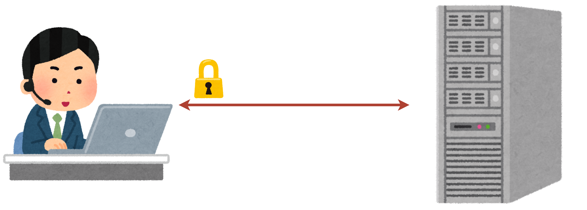
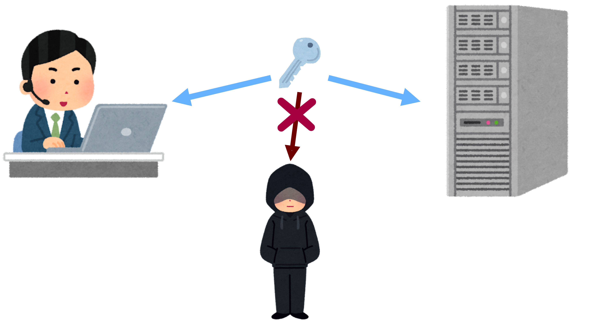
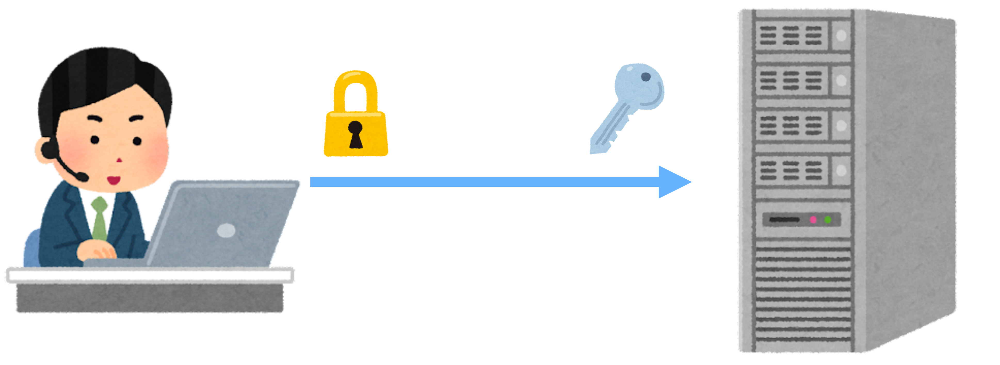
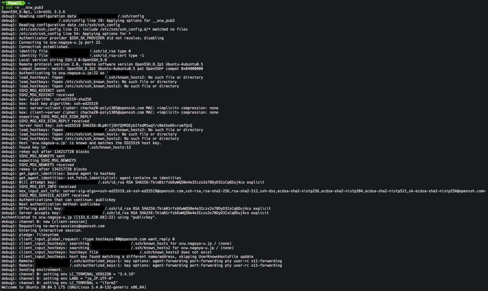

<!--
headingDivider: 2
_class: title
_paginate: false
-->

# SSHの仕組み

サーバサイド班　<a style="color:white; text-decoration: none;" href="https://github.com/kentakom1213">甲本健太 :link:</a>


## 目次

- SSHとは
  -  SSH接続の流れ
     1. クライアントによるサーバの認証
     2. セッションキーの生成
     3. サーバによるクライアントの認証

- SSHのログを見てみよう
- （おまけ）RSAとECDSA
- 参考


## SSHとは

SSHとは**Secure Shell**（安全なシェル）の略称であり、安全にリモートコンピュータと接続するためのプロトコル。

- サーバに接続して作業するときなどに利用する




---
### 実演

コマンド

```sh
$ ssh -i {秘密鍵} {ユーザ名}@{接続先のIPアドレス}
```


## SSH接続の流れ

認証段階

1. クライアントによるサーバの認証
2. セッションキーの生成
3. サーバによるクライアントの認証
<hr>

通信段階

4. データを暗号化して通信


## 1. クライアントによるサーバの認証

クライアント側が、サーバが怪しいものでないかを調べる


---
#### 初めてサーバにアクセスするとき

サーバの公開鍵を検証し、**手動で**検証を行う
→ `Are you sure you want to continue connecting (yes/no)?`
ローカルの`known_hosts`ファイルにその情報を保存する。
<hr>

#### 2回目以降

ローカルの`known_hosts`にある公開鍵情報からサーバの身元を確認


## 2. セッションキーの生成

通信の暗号化をするための鍵を生成する。
[ディフィー・ヘルマンの鍵交換](https://ja.wikipedia.org/wiki/%E3%83%87%E3%82%A3%E3%83%95%E3%82%A3%E3%83%BC%E3%83%BB%E3%83%98%E3%83%AB%E3%83%9E%E3%83%B3%E9%8D%B5%E5%85%B1%E6%9C%89)を用いて、中間者攻撃に対処




## 3. サーバによるクライアントの認証

サーバ側が、正しいクライアントに接続しているかを調べる




---
### クライアント認証の流れ

1. 鍵ペア（公開鍵、秘密鍵）を生成する
2. サーバ側に公開鍵を渡す
3. サーバがトークン（乱数）を生成しクライアントに送る
4. 自分の秘密鍵を用いてトークンを暗号化し
   暗号化したトークンをサーバに送り返す
5. サーバ側で公開鍵を用いて5を復号し、
   その結果が3と一致すれば 「**認証成功**」

c.f. [電子署名](https://ja.wikipedia.org/wiki/%E9%9B%BB%E5%AD%90%E7%BD%B2%E5%90%8D)


## SSHのログを見てみよう

`ssh`コマンドに`-v`オプションをつけると接続の際のログを確認できる




## （おまけ）RSAとECDSA

- RSA
  - 「素因数分解の困難性」ベース
  - 公開鍵暗号の最初の実装
- ECDSA
  - 「楕円曲線上での離散対数問題」ベース
  - 比較的最近開発された方法


同じ長さの鍵では、ecdsaの方が強度が高い！
→ 最近はecdsaが推奨されてます！！

## 参考

- Secure Shell (Wikipedia)
  https://ja.wikipedia.org/wiki/Secure_Shell
- OpenSSH (公式)
  https://www.openssh.com/
- Understanding SSH Workflow
  https://medium.com/@hellomudit/understanding-ssh-workflow-66a0e8d4bf65

