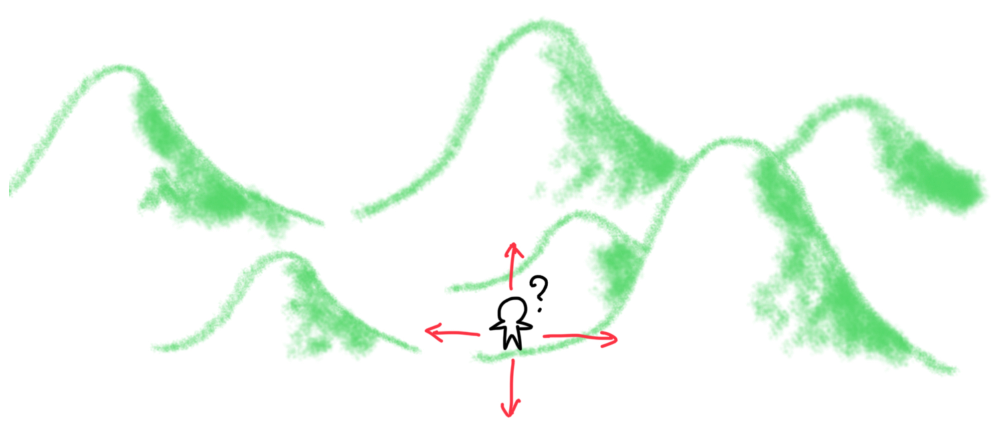
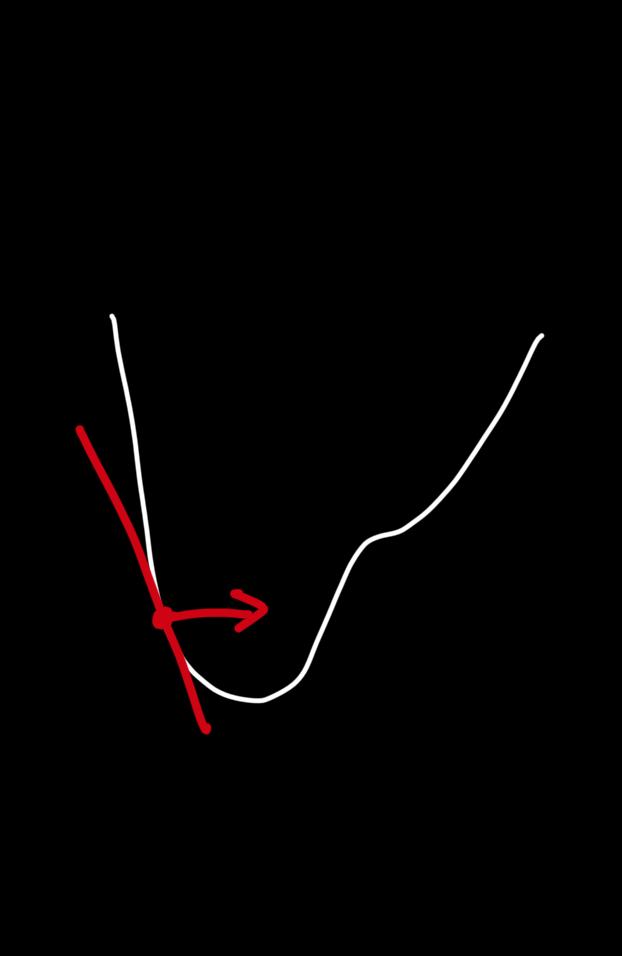
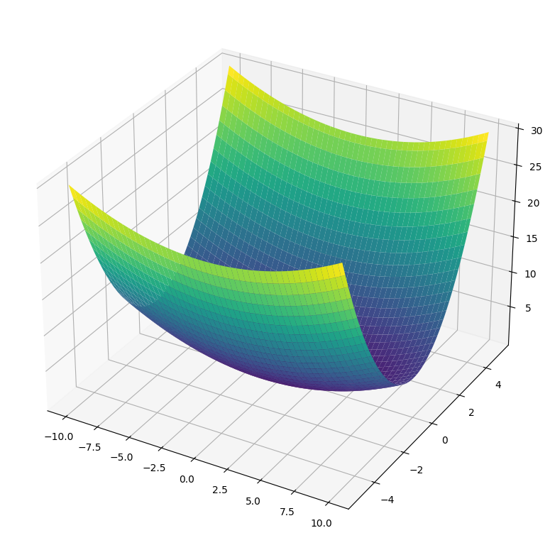
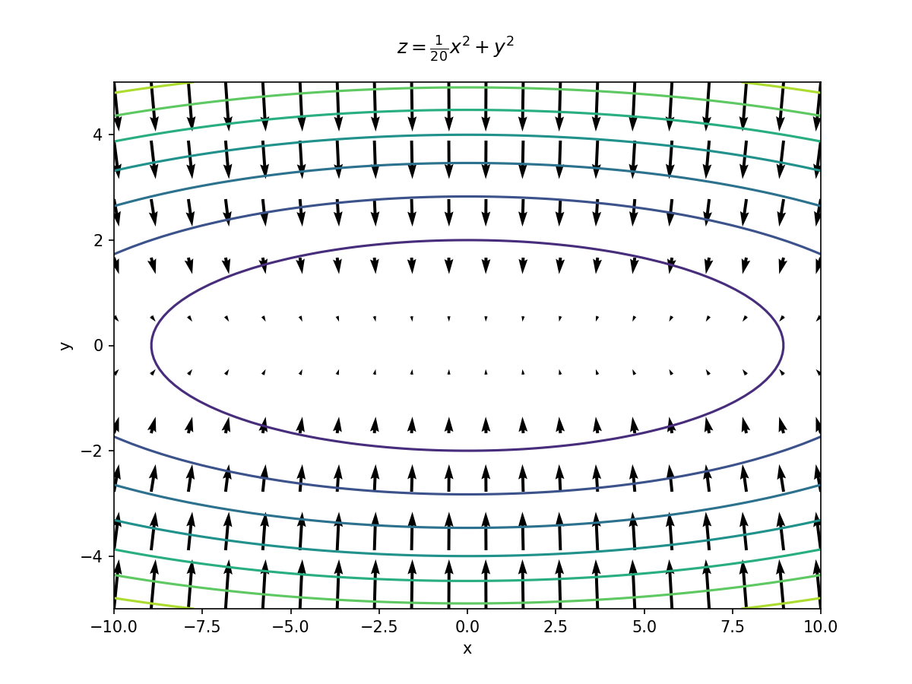
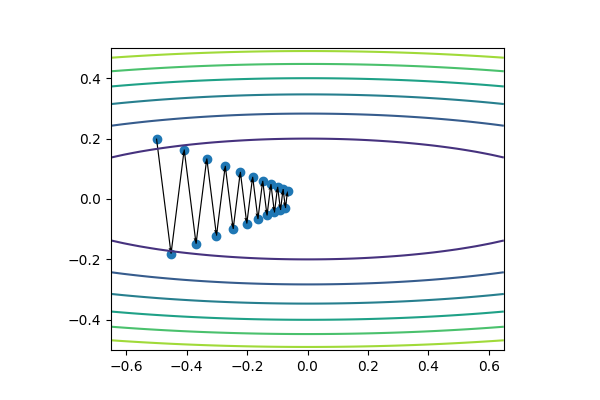
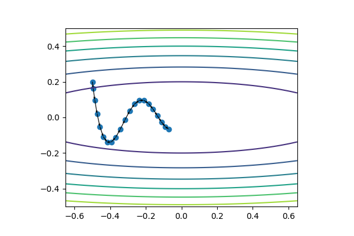

<!--
headingDivider: 2
_class: title
_paginate: false
-->

# パラメータの最適化

<a style="color:white; text-decoration: none;" href="https://github.com/kentakom1213">ぱうえる（けんた）:link:</a>


## パラメータとは

- 結果に影響を与える変数のこと
- ニューラルネットワークには、膨大な数のパラメータが存在する
  - 各層の重み
  - 各層のバイアス

<hr>
これらをどのように修正していけば、損失関数の値を最小にできる？


## パラメータの最適化
- 頂上に辿り着くため、あなたはどこに向かうべき？




## 今までの方法(SGD)

確率的勾配降下法
（Stochastic Gradient Decent）
- パラメータをもとに勾配を求め、
  勾配が小さくなるように修正

$$
W \leftarrow W - \eta\frac{\partial L}{\partial W}
$$




## SGDの弱点

こんな感じのフィールドを考えてみよう

$$
z = \frac{1}{20}x^2 + y^2
$$




## SGDの弱点

勾配はこんな感じ

- x軸の勾配→小
- y軸の勾配→大

<hr>

→どんな動き？




## SGDの弱点

こんな動き！

y軸の勾配が大きいため、無駄な動きをしている




## 試してみよう！

`optimization.ipynb`を使ってビジュアライズします:clap:

- **visualizer.Field**
  - 勾配を持ったフィールドです
  - フィールドのプロットもできます
- **visualizer.Adventurer**
  - 実際に動く人
  - たどったルートを記録します


## ビジュアライザの使い方

```python
from visualizer import Field, Adventurer

def f(x, y):
    return x^2 + y^2

field = Field(f, (-1, 1), (-1, 1))  # フィールド
adventurer = Adventurer(-0.5, 0.2)  # 冒険者（スタート地点を設定）

adventurer.optimize(field, method)  # adventurerに冒険をさせます（methodは最適化手法:SGDなど）
route = adventurer.route            # ルートが記録される

field.plot(route=route)             # どんなルートを辿ったか見られます
```


## SGDの実装

```python
class SGD:
    def __init__(self, lr=0.1):
        self.lr = lr

    def update(self, params, grads):
        # ここを考えよう！
```

↓ヒント
```python
params = {
    "x": -0.5,  # x座標
    "y": 0.2,   # y座標
}
```

## 新たな手法 "Momentum"

- "運動量"を表す言葉
- その名の通り、坂を転がり落ちていくような動き

### 計算式

$$
\begin{align}
\begin{array}{cll}
v &\leftarrow \alpha v - \eta \frac{\partial L}{\partial W} \quad&\cdots~(\text{速度の更新})\\
W &\leftarrow W + v \quad&\cdots~(\text{パラメータの更新})
\end{array}
\end{align}
$$

## Momentumの動き

グネグネ動く
↓
無駄な動きが
発生しにくい！


